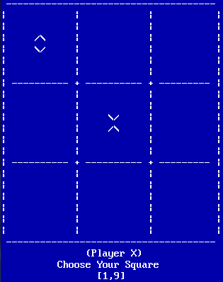

# Tic Tac Toe Game in Assembly



## Project Overview

Welcome to the Tic Tac Toe Game in Assembly repository! This project was initiated on December 14, 2012, and is an Intel x86 assembly language implementation of the classic Tic Tac Toe game. It was developed using the TASM assembler by a team of two dedicated programmers. This text-based game offers various modes of play, including Player vs. Player, Player vs. Computer, and even Computer vs. Computer.

## Game Modes

### Player Vs. Player

In this mode, two human players can take turns playing Tic Tac Toe on the same computer. Simply take your turns using the keyboard or mouse to select your moves.

### Player Vs. Computer

Challenge your wits against the computer! This mode allows you to play against an AI opponent. Can you outsmart the computer and win the game?

### Computer Vs. Computer

Sit back and watch as two computer players battle it out. This mode is perfect for those who want to see how AI algorithms fare against each other.

## Features

- **Fully Textual Interface:** The game provides a text-based interface for a classic gaming experience. No fancy graphics, just pure gameplay.

- **Keyboard Availability:** Control the game using your keyboard for quick and precise moves. Use the arrow keys and other keybindings to make your selections.

- **Mouse Availability:** If you prefer a mouse, don't worry! The game supports mouse input, making it easy to click your way through the game board.

## Getting Started

To run this assembly-based Tic Tac Toe game on your system, follow these steps:

1. Clone this repository to your local machine.

   ```shell
   git clone https://github.com/ahmad-siavashi/Tic-Tac-Toe.git
   ```

2. Ensure you have TASM (Turbo Assembler) installed on your system.

3. Open the project directory and assemble the source code using TASM.

   ```shell
   tasm XO.asm
   ```

4. Link the generated object file using TLink or another linker.

   ```shell
   tlink XO.obj
   ```

5. Run the compiled executable.

   ```shell
   XO.exe
   ```

6. Enjoy the game! Select your game mode and have fun playing Tic Tac Toe.

> Please note that a pre-compiled executable is also available [here](XO.EXE).

## Contributions

We welcome contributions to this project! If you'd like to enhance the game or fix any issues, feel free to fork the repository, make your changes, and create a pull request. We'll be happy to review your contributions.

Happy gaming!
